# kottans-frontend

## 1. Linux CLI, and HTTP
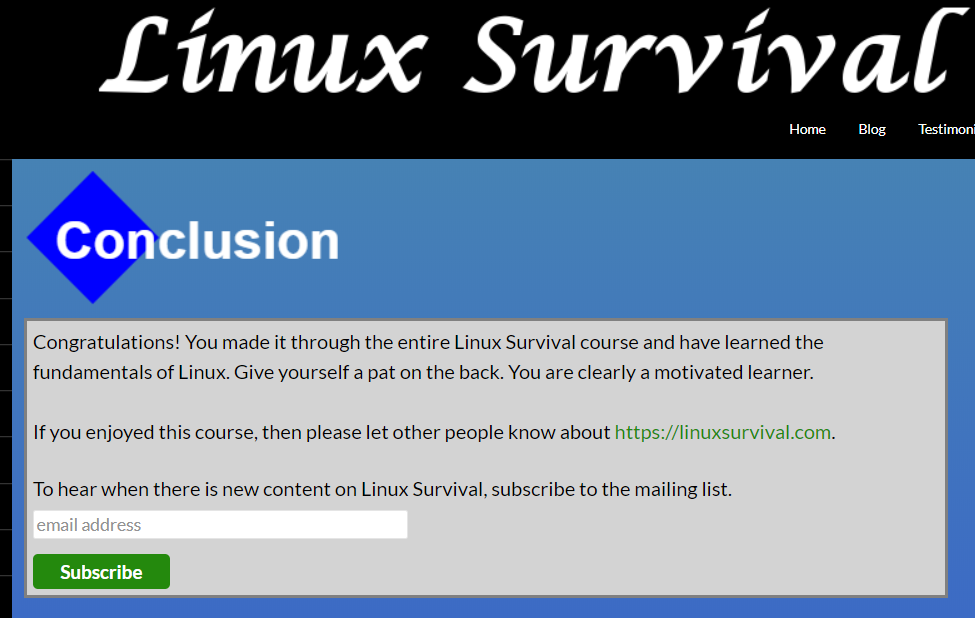

## 2. Git Collaboration
### Version Control with Git

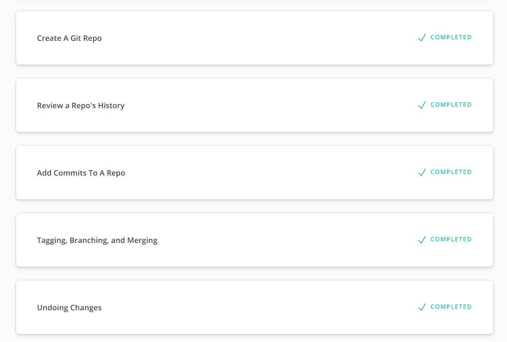

### GitHub & Collaboration
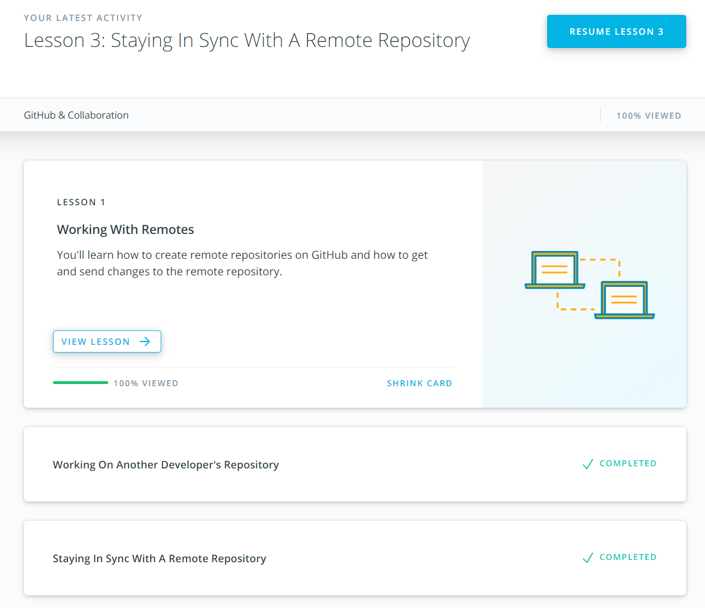

## 3. Intro to HTML and CSS
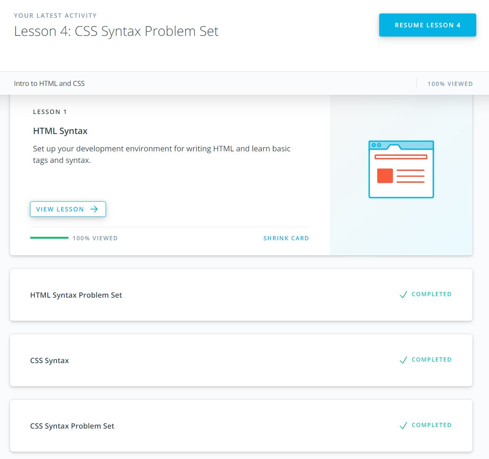
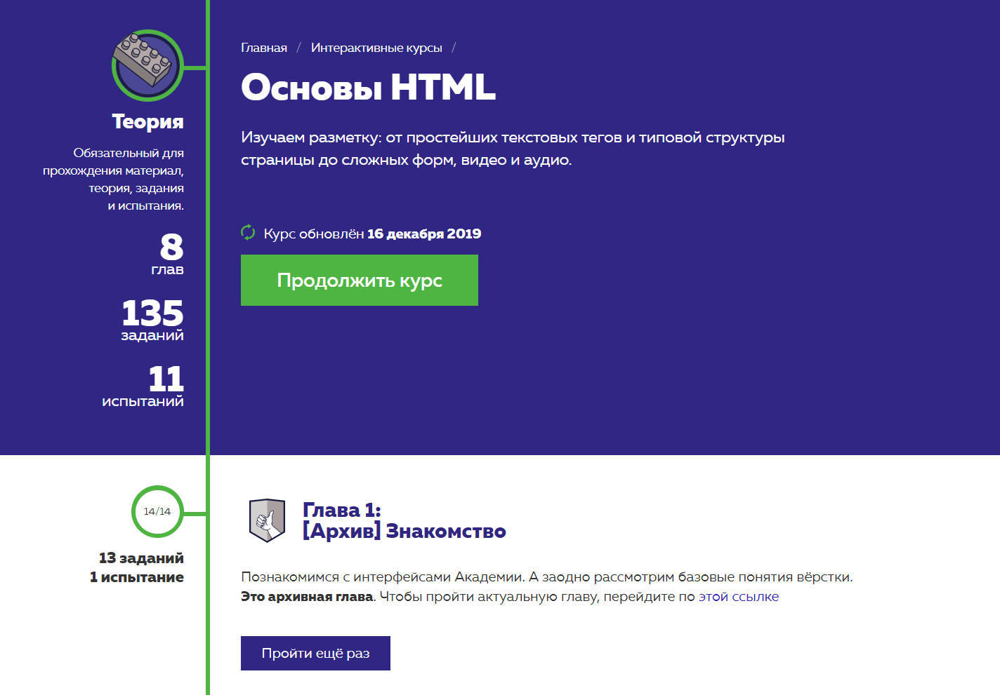
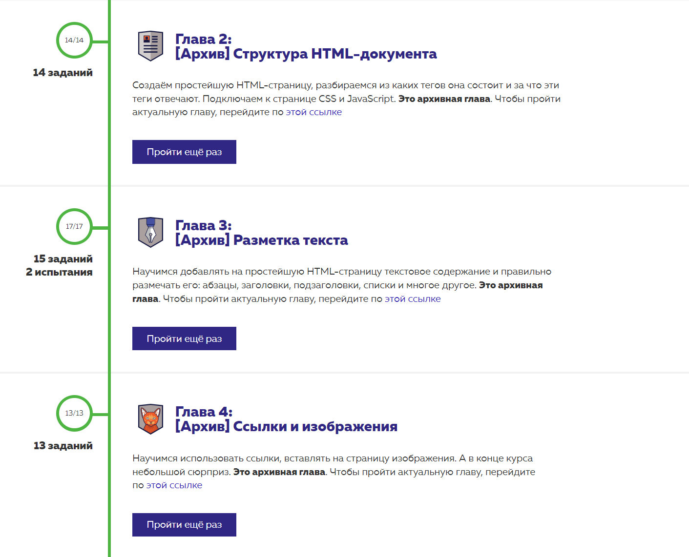
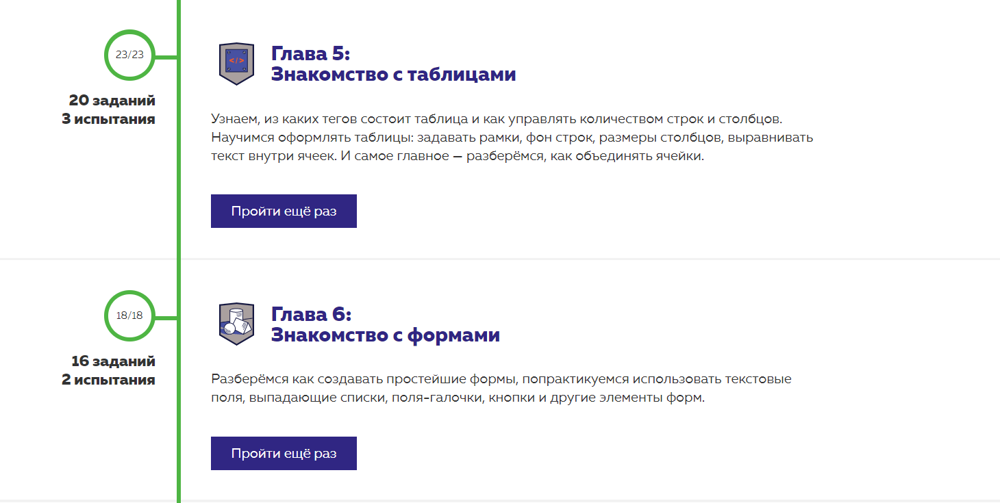
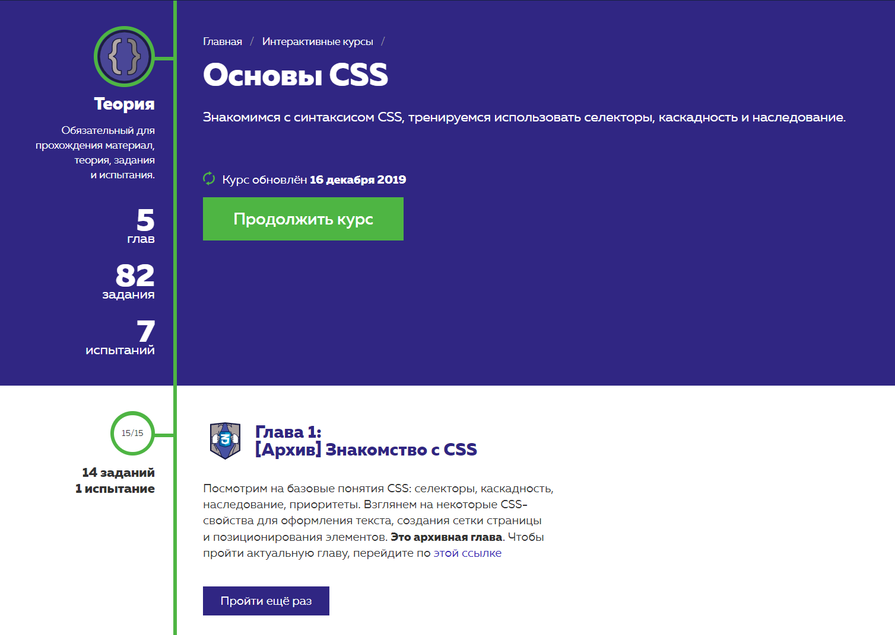
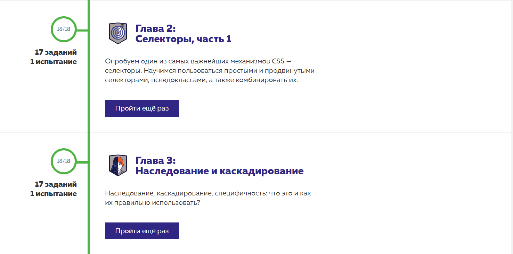

## 4. Responsive Web Design
### Responsive Web Design Fundamentals
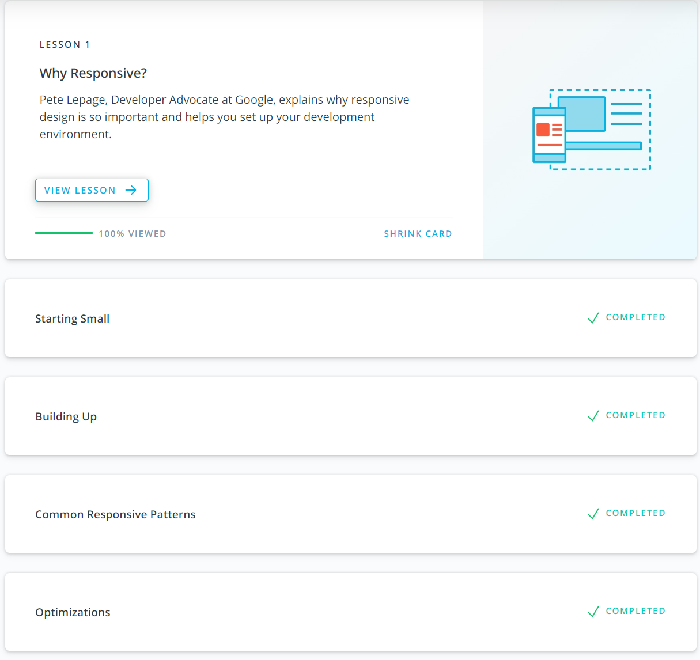

### Flexbox Froggy
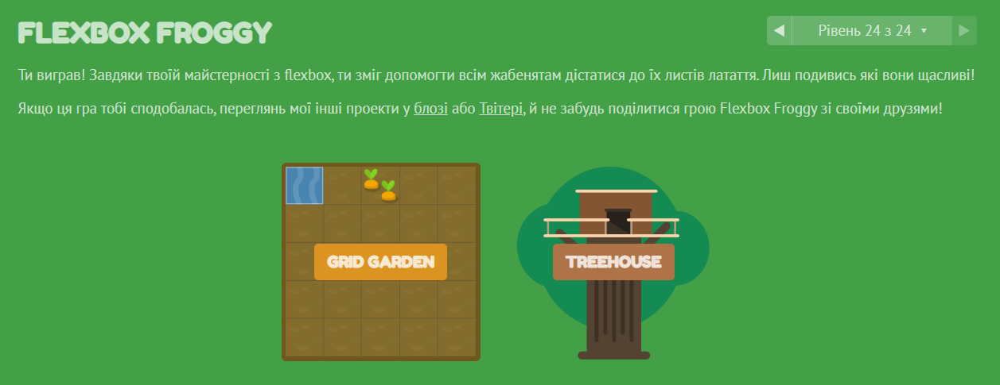
