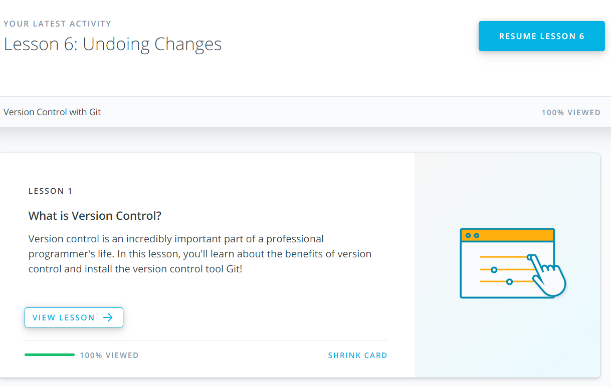

# kottans-frontend

## 1. Linux CLI, and HTTP

## 2. Git Collaboration
### Version Control with Git

### GitHub & Collaboration

## 3. Intro to HTML and CSS

## 4. Responsive Web Design
### Responsive Web Design Fundamentals

### Flexbox Froggy

